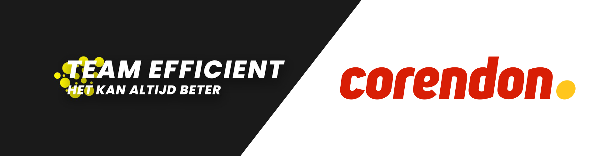

## Inhoudsopgave

1. Business Case
- [Samenvatting](https://gitlab.fdmci.hva.nl/FYS/2021/is106/team-5/-/wikis/Business-Case/1---Samenvatting)
- [Aanleiding](https://gitlab.fdmci.hva.nl/FYS/2021/is106/team-5/-/wikis/Business-Case/2-Aanleiding)
- [Aanpak](https://gitlab.fdmci.hva.nl/FYS/2021/is106/team-5/-/wikis/Business-Case/3-Aanpak)
- [Verwachte-resultaten](https://gitlab.fdmci.hva.nl/FYS/2021/is106/team-5/-/wikis/Business-Case/4-Verwachte-resultaten)
- [Risico's](https://gitlab.fdmci.hva.nl/FYS/2021/is106/team-5/-/wikis/Business-Case/5-Risico's)
- [Alternatieven](https://gitlab.fdmci.hva.nl/FYS/2021/is106/team-5/-/wikis/Business-Case/6-Alternatieven)
- [Globale-planning](https://gitlab.fdmci.hva.nl/FYS/2021/is106/team-5/-/wikis/Business-Case/7-Globale-planning)
2. Requirements
- [Functional Requirements](https://gitlab.fdmci.hva.nl/FYS/2021/is106/team-5/-/wikis/Requirements/1-Functional-Requirements)
- [Non Functional Requirements](https://gitlab.fdmci.hva.nl/FYS/2021/is106/team-5/-/wikis/Requirements/2-Non-Functional-Requirements)
3. Procesboek
- [Inleiding](https://gitlab.fdmci.hva.nl/FYS/2021/is106/team-5/-/wikis/Business-Case/3-Aanpak)
- [Blok 1](https://gitlab.fdmci.hva.nl/FYS/2021/is106/team-5/-/wikis/Procesboek/Blok-1)
- [Blok 2](https://gitlab.fdmci.hva.nl/FYS/2021/is106/team-5/-/wikis/Procesboek/Blok-2)
- [Sterkte en zwakteanalyse](https://gitlab.fdmci.hva.nl/FYS/2021/is106/team-5/-/wikis/Procesboek/Sterkte--en-zwakteanalyse)
4. Samenwerking-contract
- [Inleiding](https://gitlab.fdmci.hva.nl/FYS/2021/is106/team-5/-/wikis/Samenwerking-contract/1-Inleiding){:target="_blank"}
- [Communicatieve afspraken](https://gitlab.fdmci.hva.nl/FYS/2021/is106/team-5/-/wikis/Samenwerking-contract/2-Communicatieve-afspraken){:target="_blank"}
- [Werkwijze](https://gitlab.fdmci.hva.nl/FYS/2021/is106/team-5/-/wikis/Samenwerking-contract/3-Werkwijze){:target="_blank"}
- [Sancties](https://gitlab.fdmci.hva.nl/FYS/2021/is106/team-5/-/wikis/Samenwerking-contract/4-Sancties){:target="_blank"}
- [Ondertekening](https://gitlab.fdmci.hva.nl/FYS/2021/is106/team-5/-/wikis/Samenwerking-contract/5-Ondertekening){:target="_blank"}

## Introductie FYS Project

Corendon wil reizigers die alleen reizen in contact brengen met elkaar, en zijn daarvoor opzoek naar een oplossing.
Voor dit probleem willen wij, Team Efficiënt, graag een goedwerkende oplossing bieden.

Nederland telt naar verwachting in 2030 meer dan 3 miljoen alleenstaanden, een alleenstaande is een vrijgezel, een gescheiden persoon met/of zonder kinderen of een weduwe/weduwnaar.

Het natuurlijk niet altijd leuk om in je ééntje op vakantie te gaan, want samen kan je veel meer van dingen genieten dan als je alleen bent. Wij willen deze mensen graag helpen en denken hiervoor de juiste oplossing te hebben.

Wat nou als we via een website mensen in verbinding kunnen brengen, zodat zij ook kunnen genieten van een vakantie die niet alleen doorgebracht is! Dit is een uitkomst voor de persoon die graag weg wil op vakantie, maar zo'n avontuur liever niet alleen aangaat.
Corendon vliegt naar 22 landen vanuit Amsterdam, dit betekent dat er voor de vakantieganger genoeg opties zijn om het samen eens te worden over het juiste vakantieland.

Door een goed uitgebreide set van opties, zoals interesses, wat voor soort vakantie (denk dan aan avontuurlijk, cultureel of juist relaxen) en nog veel meer kunnen we de juiste mensen aan elkaar linken. Deze kunnen dan na overleg met elkaar samen de perfecte vakantie boeken waar ze het nog vele jaren over zullen hebben.

## Over Team efficiënt

### Saif Rashed (Motivator, Controleur)
Email: info@saifrashed.nl  
Telefoon: 06-40727258

> Hoi ik ben Saif, Ik ga regelmatig naar de sportschool en hou wel van een leuk feestje. Daarnaast ben ik afgestudeerd op het MBO en hoop ik dit jaar verder te kunnen met HBO.

### Thor Ruigrok (Producent, Controleur)
Email: Thorruigrok@hotmail.com  
Telefoon: 06-39251846

> Hey ik ben Thor, 22 jaar oud en kom van de VU nu naar de HvA om HBO-ICT te studeren. Ik ben fan van gamen en ben daarnaast ook graag met mijn vrienden. Ik ben er van overtuigd dat wij als team een mooi project kunnen realiseren.

### Callum Svadkovski (Organisator, Creatieveling)
Email: Callum4a@gmail.com  
Telefoon: 06-50525503

> Ik ben Callum, ben 22 jaar en woon in Amsterdam-Oost. Ik hou ervan om te sporten, in de sportschool, op het voetbalveld of tijdens een lekker rondje rennen. Met dit team ben ik zeker dat we een mooi project neer gaan zetten.

### Lars van der Sluijs (Producent, Controleur)
Email: Larsvdsluijs10@gmail.com  
Telefoon: 06-28389650

> Hoi ik ben Lars, 17 jaar oud en ik kom van het veenlanden college in Mijdrecht en heb daar mijn Havo diploma behaald. Ik hou veel van sporten en gamen doe ik ook graag in mijn vrije tijd. Ik hoop af te kunnen studeren aan de Hva voor de opleiding Software Engineering.

### Yusuf Kara (Producent, Controleur)
Email: Yusuf.kara.1@outlook.com
Telefoon: 06-54136086

> Ik ben Yusuf, 18 jaar oud. Ik hou van sporten en game in mijn vrije tijd. Ik heb bij het Farel College gestudeerd en heb mijn havo-diploma behaald. Ik hoop dit jaar verder te kunnen studeren op het HBO. 